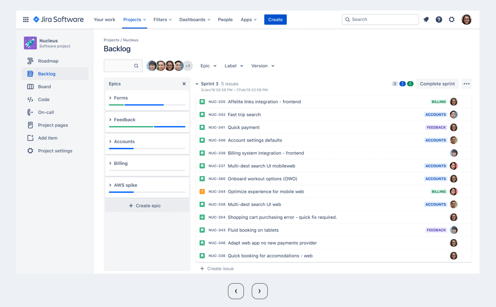

# Temat projektu

Celem niniejszego projektu jest szczegółowe zaprezentowanie systemu ticketowego **Jira**, ze szczególnym uwzględnieniem jego funkcjonalności, zastosowań oraz procesu wdrożenia w środowisku organizacyjnym. Jira to zaawansowane narzędzie wspierające zarządzanie projektami, zadaniami oraz błędami, wykorzystywane głównie przez zespoły IT, programistyczne oraz DevOps.

W projekcie zostaną omówione:
- kluczowe moduły systemu Jira (m.in. zarządzanie backlogiem, workflow, raportowanie),
- jego integracja z innymi narzędziami, m.in. **Confluence**, **Git** czy CI/CD,
- korzyści i wyzwania związane z wdrożeniem Jiry w środowisku firmowym.

Część praktyczna projektu pokaże, jak Jira wspiera zwinne metodyki zarządzania projektami, takie jak **Scrum** oraz **Kanban**, przyczynając się do poprawy efektywności pracy zespołów oraz lepszego monitorowania postępów.

