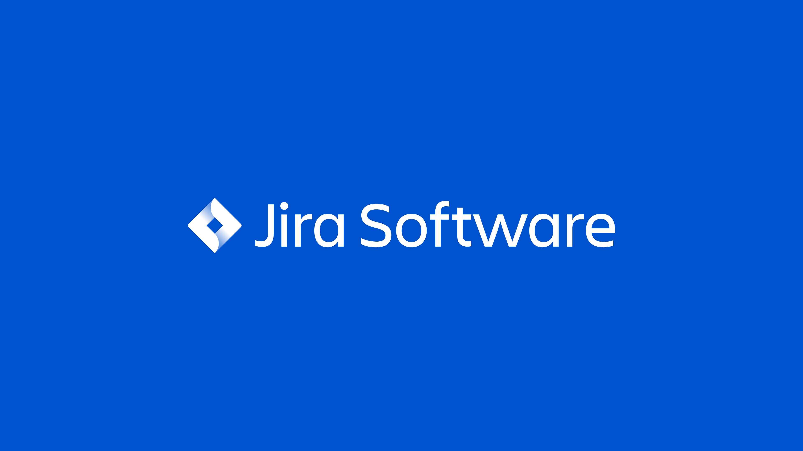

# Temat projektu

Celem niniejszego projektu jest szczegółowe zaprezentowanie systemu ticketowego **Jira**, ze szczególnym uwzględnieniem jego funkcjonalności, zastosowań oraz procesu wdrożenia w środowisku organizacyjnym. Jira to zaawansowane narzędzie wspierające zarządzanie projektami, zadaniami oraz błędami, wykorzystywane głównie przez zespoły IT, programistyczne oraz DevOps.

W projekcie zostaną omówione:
- kluczowe moduły systemu Jira (m.in. zarządzanie backlogiem, workflow, raportowanie),
- jego integracja z innymi narzędziami (np. Confluence, Git, CI/CD),
- oraz korzyści i wyzwania związane z wdrożeniem tego systemu w rzeczywistym środowisku firmy IT.

Celem praktycznym projektu jest pokazanie, w jaki sposób Jira może wspomagać zwinne metodyki zarządzania projektami (takie jak Scrum czy Kanban) oraz jak można skonfigurować środowisko pracy dostosowane do potrzeb konkretnego zespołu.

